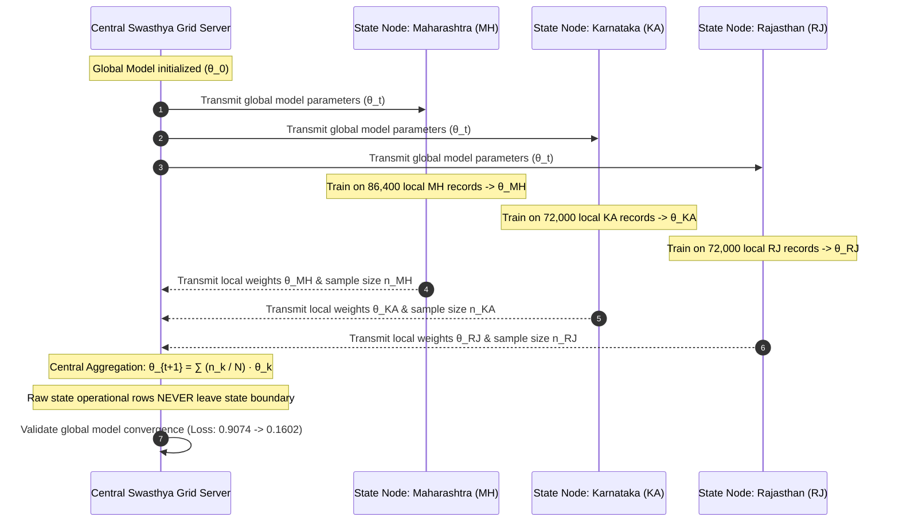
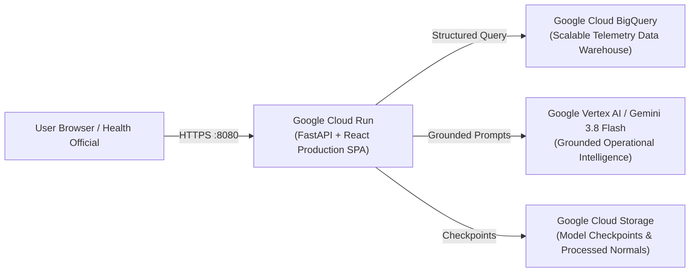

# Technical Architecture & Systems Engineering Specification
## Swasthya Grid: Federated AI Control Tower for India's Public Health Supply Chain

---

## 1. High-Level System Architecture

Swasthya Grid links verified Government of India public data anchors with decentralized state-local operational nodes, machine learning forecasting pipelines, deterministic redistribution optimization, and Google Gemini operational grounding.

```mermaid
flowchart TD
    subgraph DataSources["1. Verified Public Ground Truth Anchors"]
        LGD["LGD (Local Government Directory)\nState & Canonical District Codes"]
        Census["Census 2011 PCA\nDistrict Population Baselines"]
        Beds["MoHFW RHS 31-03-2023\nState Public Bed Capacities"]
        HMIS["HMIS District Monthly\nDisease & Service Indicators"]
        IMD["IMD Meteorological Climatology\nRainfall Normals & Alert Signals"]
        NLEM["NLEM 2022 Gazette\nEssential Drug Catalogue"]
    end

    subgraph Simulation["2. Calibrated Causal Operational Simulation"]
        SimGen["Causal Simulation Engine (seed=42)\n208 PHCs in 26 Districts\nDaily Demand, Beds, Staff, Inventory"]
        MassConserv["Strict Conservation of Mass\nClosing = Opening + Recv - Disp - Damaged"]
    end

    subgraph DecentralizedEdge["3. Decentralized State Operational Partitions"]
        NodeMH["State Edge Node: Maharashtra\n48 PHCs | 86,400 Records\nState-Local Storage"]
        NodeKA["State Edge Node: Karnataka\n40 PHCs | 72,000 Records\nState-Local Storage"]
        NodeRJ["State Edge Node: Rajasthan\n40 PHCs | 72,000 Records\nState-Local Storage"]
    end

    subgraph FederatedEngine["4. Federated Learning Engine (FedAvg)"]
        LocalTrain["State-Local Neural Training\n(Parameters θ_k trained locally)"]
        CentralAgg["Central Parameter Aggregator\nθ_global = ∑ (n_k / N) · θ_k\n(Zero Raw Row Transmission)"]
        GlobalModel["Global Demand Model v3.0-fedavg\nMSE Loss: 0.1602 | MAE: 8.01"]
    end

    subgraph MLForecasting["5. Production Machine Learning & Decision Engine"]
        HistGBM["Model A: Demand Forecaster (HistGBM)\n7-Day Horizon | sMAPE: 14.71%"]
        StockClassifier["Model B: Stockout Classifier (HistGBM)\nP(Stockout < 7d) | F1: 0.989"]
        Redistrib["Deterministic Transfer Optimizer\nMinimizes Distance & Unmet Deficits\nMaintains Source Safety Stock"]
        EmergencySim["Emergency Stress Tester\nBefore vs After Dynamic Recalculation"]
    end

    subgraph GoogleAI["6. Grounded Google AI / Vertex AI"]
        GeminiService["Google Gemini 3.8 Flash (google-genai SDK)\nStrict Tool Grounding\nZero Fabricated Numbers"]
    end

    subgraph ApplicationLayer["7. Command Centre & API"]
        FastAPI["FastAPI Backend Service\nREST Telemetry & Invariants"]
        ReactApp["React 19 + TypeScript + Tailwind CSS\n10 Command Centre Views • Multilingual (EN/HI/MR)"]
    end

    DataSources --> SimGen
    SimGen --> MassConserv
    MassConserv --> DecentralizedEdge
    DecentralizedEdge --> LocalTrain
    LocalTrain --> CentralAgg
    CentralAgg --> GlobalModel
    GlobalModel --> MLForecasting
    DecentralizedEdge --> MLForecasting
    MLForecasting --> FastAPI
    MLForecasting --> GeminiService
    FastAPI --> ReactApp
    GeminiService --> ReactApp
```

---

## 2. Decentralized Federated Learning Architecture

To respect state healthcare boundaries and avoid concentrating raw facility clinical and operational logs in one centralized server, Swasthya Grid implements **Federated Averaging (FedAvg)**:

---

## 3. Mathematical Optimization Formulation: Resource Redistribution

Redistribution is **strictly deterministic** (not generated by an LLM). Given candidate donor facilities $i \in \mathcal{S}$ and deficit recipient facilities $j \in \mathcal{D}$ for medicine $m$:

$$\min \sum_{i \in \mathcal{S}} \sum_{j \in \mathcal{D}} \left( d_{ij} \cdot c_{\text{transport}} + \text{Penalty}(j) \right) x_{ijm}$$

Subject to:
1. **Donor Safety Stock Invariant**:
   $$\sum_{j} x_{ijm} \le \text{Current Stock}_{im} - \text{Safety Stock}_{im}$$
2. **Deficit Cap**:
   $$\sum_{i} x_{ijm} \le \text{Shortage Requirement}_{jm}$$
3. **Transport Distance Feasibility**:
   $$d_{ij} \le D_{\max} \quad (\text{Default: } 120\text{ km})$$
4. **Conservation of Quantities**:
   $$x_{ijm} \ge 0, \quad x_{ijm} \in \mathbb{Z}^+$$

---

## 4. Google Cloud Production Deployment Topology

---

## 5. National Scale Projection Architecture

| Dimension | Pilot Prototype Coverage | Production Scale Architecture |
| :--- | :--- | :--- |
| **States / UTs** | 5 States (MH, KA, RJ, TN, UP) | All 36 States & Union Territories |
| **Districts** | 26 Canonical LGD Districts | All 788 LGD Districts |
| **PHCs** | 208 Calibrated Simulated PHCs | 31,053 PHCs (MoHFW RHS Reference) |
| **Medicines** | 20 Core NLEM Formulations | 384 NLEM Essential Formulations |
| **Daily Records** | ~500,000 Historical Records | ~15 Million Records / Month |
| **Storage Engine** | SQLite (WAL mode, <50MB) | Google Cloud BigQuery + Cloud Spanner |
| **Federated Nodes**| 3 Emulated State Edge Servers | 36 Dedicated State Data Centre Nodes |
